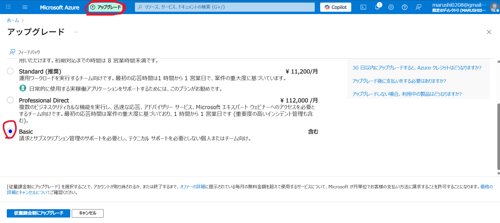

最終更新日：2025/07/21（v1.1）

# カルステップ正式版 Azure設定マニュアル

この度はカルステップをご購入いただき、誠にありがとうございます！
本マニュアルでは、正式版でのMicrosoft Azure環境の設定手順をご説明いたします。

## ご購入いただいた皆様へのお願い

### X（旧Twitter）での感想投稿
カルステップをより多くのクリニック様に知っていただくため、ご感想をX（旧Twitter）でシェアしていただけますと大変助かります。投稿の際は「#カルステップ」を添えて、以下の投稿を引用リポストしてください。

対象投稿： [https://x.com/Dr_kurukuru/status/1945487347409412533](https://x.com/Dr_kurukuru/status/1945487347409412533)

皆様からの発信が、カルステップの普及と今後のサービス向上に大きく貢献いたします。ご協力のほど、よろしくお願いいたします。

## 備品について

お渡しした備品（フットスイッチなど）は、そのまま継続してご利用ください。
端末ライセンスは正式版として再発行させていただきます。

---

# Azure環境の設定手順

カルステップ正式版では、お客様専用のMicrosoft Azureアカウントを開設していただき、APIの利用料金をお客様にご負担いただく形となります。
以下、設定手順をご説明いたします。

## Azureアカウント開設
解説動画： [https://youtu.be/2_lAmjdG-D8](https://youtu.be/2_lAmjdG-D8)

1.  Googleなどの検索エンジンで「Azure」と検索し、「Microsoft Azure」の公式サイトをクリックしてください。
2.  Azureのページが表示されたら、「Azure を無料でお試しください」をクリックします。
3.  「アカウントをお持ちでない場合、作成できます」の下線が引いてある「作成」リンクをクリックしてください。
4.  登録に使用するメールアドレスを入力します。
5.  入力したメールアドレスに届いたセキュリティコード（確認コード）を入力します。
6.  画面の指示に従い、生年月日などの必要情報を入力します。
7.  電話番号を入力し、SMSなどで受信した確認コードを入力して認証を行ってください。
8.  利用規約等への同意にチェックを入れ、「次へ」をクリックします。
9. クレジットカードの情報を入力します。（最初の30日間は200ドル相当の無料クレジットが利用可能です。）
10. アカウントの保護に関する設定画面が表示された場合は、画面の指示に従い「次へ」をクリックして進めてください。
11. アグリーメント（契約条件）を確認し、同意のチェックを入れて次に進みます。
12. テクニカルサポートのプラン選択画面が表示された場合、「サポートに加入しない」を選んでください。

上記の手順が完了すると、Azureアカウントの登録は終了です。これで、Azureの各種サービスが利用可能な状態になります。

## 2段階認証の設定
解説動画： [https://youtu.be/2qsM79MaTkQ](https://youtu.be/2qsM79MaTkQ)

Azureアカウントのセキュリティを強化するため、2段階認証の設定を強く推奨いたします。

1.  Azureポータルの右上に表示されているご自身のアカウントアイコンをクリックし、「Microsoft アカウント」を選択してください。
2.  表示されたアカウント管理ページの左側にあるタブから「セキュリティ」を選択します。
3.  セキュリティのオプションが表示されますので、「サインイン方法の管理」をクリックしてください。
4.  2段階認証の項目を見つけ、「オンにする」をクリックします。
    * まだアカウントのパスワードを設定していない場合は、このタイミングでパスワードの設定を求められることがあります。画面の指示に従ってパスワードを設定してください。
5.  追加認証の方法を選択する画面が表示されます。セキュリティの観点から、認証アプリ（例：Microsoft Authenticator）のご利用をお勧めします。
    - 認証の手段が「アプリ」になっている状態で「今すぐ取得」ボタンをクリックします。
    - 携帯電話（スマートフォン）で認証アプリを準備します。Microsoft Authenticatorアプリ（鍵の中に人が描かれたようなアイコンが目印です）をダウンロードし、インストールしてください。
    - アプリの準備が整ったら、パソコンの画面で「次へ」をクリックします。
    - パソコンの画面にQRコードが表示されます。携帯電話にインストールしたMicrosoft Authenticatorアプリを起動し、画面の指示に従ってこのQRコードをスキャンしてください。（右下にQRコードアイコンがあるのでそれをタップします。）
    - QRコードの読み取りが成功し、アプリとの連携が完了すると、認証アプリによる2段階認証の基本的なセットアップは完了です。

すべての設定が完了したら、再度セキュリティの画面に戻り、2段階認証が「オン」になっていることをご確認ください。

**注記：** 設定直後に2段階認証が「オフ」と表示されている場合があります。その際は、一度ページを更新するか、再度2段階認証の管理画面に入り直して設定状況を確認してください。正しく設定が完了していれば、「2段階認証が承認されました」といった趣旨のメッセージが表示されるか、ステータスが「オン」に変わります。

以上で、2段階認証の設定は完了です。これにより、アカウントのセキュリティが向上します。

## Azureの委任手続き
解説動画： [https://youtu.be/FyNI4saCLik](https://youtu.be/FyNI4saCLik)

カルステップでは、Azureサービスによる文字起こしや生成AIの機能を利用します。これらの詳細な設定作業をカルステップ運営にお任せいただくための委任設定についてご説明します。

### 1. サブスクリプション名の変更
1.  Azureポータルの検索バーに「サブスク」と入力し、表示された「サブスクリプション」を選択してください。
2.  リストに表示されている「Azure サブスクリプション 1」（または類似の名称のサブスクリプション）をクリックします。
    **【重要】 サブスクリプションが一覧にない場合**
    - もし一覧にサブスクリプションが表示されない場合は、新規作成が必要です。まず**「無料試用版」でサブスクリプション**を作成してください。
    - ただし、無料試用版のままでは本サービスのAI機能（Azure OpenAI Service）がご利用いただけません。そのため、作成後に**従量課金プランへのアップグレード**が必要となります。
    - **アップグレードの手順は非常に簡単です：**
        1. サブスクリプション作成後、Azureのホーム画面に戻ってください。
        2. 上部のメニューバーに表示される**「アップグレード」ボタン**をクリックします。
        3. プラン選択画面で、**「Basic」プラン**（月額料金が発生しないプラン）を選択してください。
        4. 画面の指示に従って登録を完了すれば、アップグレード完了です。
    - **ご安心ください。追加の費用負担はありません。**このアップグレード手順を行うことで、無料試用版で取得した**200ドル分の無料クレジットはそのまま継続**してご利用いただけます。1か月後以降も実際に利用した分のみ料金が発生するプランのため、想定外の費用がかかることはありません。
     
3.  サブスクリプションの詳細画面で、「名前の変更」をクリックしてください。
4.  表示された入力欄に、あなたの「クリニック名」を入力し、「保存」をクリックします。

* **変更理由：** カルステップ運営側では複数のアカウントを管理しております。誤操作を防ぎ、お客様のアカウントを明確に識別するために、分かりやすい名称に変更をお願いいたします。

### 2. Azure Lighthouseの設定
1.  Azureポータルの検索バーに英語で「Lighthouse」と入力し、表示された灯台マークの「Azure Lighthouse」を選択してください。
2.  Azure Lighthouseの画面が表示されたら、右側にある「サービスプロバイダーのオファーの表示」を選択し、続いて、画面中央の「サービスプロバイダーのオファーの表示」ボタンをクリックしてください。
3.  画面左上にある「オファーの追加」をクリックし、ドロップダウンメニューから「テンプレート経由で追加」を選択してください。
4.  「テンプレートをアップロード」の画面が表示されます。あらかじめダウンロードしていただいたカルステップのフォルダ内にある「**karustep-lighthhouse-v2.json**」というファイルを、点線の枠内にドラッグ＆ドロップしてください。
5.  ファイルが選択されたことを確認し、「アップロード」ボタンをクリックします。
6.  「カスタムデプロイ」というページに移動します。以下の項目を設定してください。
    * **サブスクリプション：** 先ほど名前を変更したサブスクリプション（例：ご自身のクリニック名）を選択してください。
        * **注記：** サブスクリプション名の変更が反映されるまで10分以上かかる場合があります。変更直後で新しい名前が表示されない場合は、元の「Azure サブスクリプション 1」などの名称を選択して進めていただいて問題ありません。
    * **リージョン：** 「**(Asia Pacific) Japan East**」（東日本）を選択してください。
    * 下部にある「Msp Offer Name」と「Msp Offer Description」の項目は、アップロードしたテンプレートファイルの内容が自動的に反映されるため、変更の必要はありません。
7.  入力内容を確認し、「確認と作成」ボタンをクリックしてください。
8.  検証が成功すると、画面下部に青色の「作成」ボタンが表示されますので、クリックしてください。（一時的に白い画面になることがありますが、エラーではありませんのでしばらくお待ちください。）
9.  「デプロイが完了しました」というメッセージが表示されたら、この作業は完了です。

### 3. 委任の確認
1.  再度Azureポータルの検索バーから「Azure Lighthouse」を検索し、選択します。
2.  右側の「サービスプロバイダーのオファーの表示」を選択し、次に右側にある「委任の表示」ボタンをクリックしてください。
3.  表示されたリストの上部にある「最新の情報に更新」ボタンをクリックします。
4.  以下の情報が表示されていれば、委任は正しく完了しています。
    * **サブスクリプション名：** ご自身で設定したクリニック名（または元のサブスクリプション名）
    * **オファー名：** Karustep_Lighthouse_Template
    * **サービスプロバイダー：** 合同会社MJSカンパニー
    * **ロールの割り当て：** 「共同作成者」と「削除ロール」

お疲れ様でした。これでAzureの委任手続きは完了です。
最後に、カルステップ運営サイドでは委任された通知が来ないため、委任手続きが完了したことをカルステップ運営（[drkurukuru@gmail.com](mailto:drkurukuru@gmail.com)）までご連絡ください。

ご連絡をいただき次第、正式版のAPI-keyを発行させていただきます。お手数をおかけしますが、どうぞよろしくお願い致します。

## カルステップへのAPI-keyなどの登録
解説動画： [https://youtu.be/oCLn4hZQPRw](https://youtu.be/oCLn4hZQPRw)

Azureの委任手続きが完了したことをカルステップ運営が確認次第、文字起こしや要約に使用するAPI-keyを発行いたします。発行されたAPI-keyなど、カルステップに登録が必要な情報は、まとめてHTML形式の添付ファイルとしてメールでお送りします。

1.  **運営からの情報受領**
    1.  カルステップ運営より、正式版の設定情報が記載された「1Passwordの共有リンク」がメールで届きます。
    2.  このリンクを開くには、運営と連絡を取り合っている「**メールアドレス**」での認証が必要です。メールアドレスを入力すると、認証コードが届きますので、そちらを入力してアクセスしてください。
    3.  **【重要】閲覧可能期間は原則7日間です。**有効期限が過ぎた場合は、再度運営にご連絡ください。

2.  **設定情報の確認**
    1.  添付されているHTMLファイルをPCに保存するか、直接開いてください。
        * HTMLファイルを開くと、Google Chromeなどのブラウザで表示されますが、これはPC内のファイルを開いている状態であり、インターネットには接続されていません。
    2.  ファイルを開くとパスワードの入力が求められます。別途送られてきたメールに記載されているパスワードをコピー＆ペーストし、「認証して開く」をクリックしてください。
    3.  認証に成功すると、以下の4つの情報が表示されます。
        * Azure Speech Key（正式版）
        * Azure OpenAI API Key（正式版）
        * Azure OpenAI Endpoint（正式版）
        * Google Spreadsheet ID

3.  **カルステップアプリへの登録**
    1.  カルステップのアプリケーションを起動してください。
    2.  画面上部の「設定」タブをクリックし、次に「APIキーの登録」を選択してください。
    3.  表示された設定画面の各項目に、先ほどHTMLファイルで確認した情報を入力（コピー＆ペースト）します（HTMLファイルの各項目の右側にあるコピーボタンをクリックすればコピーできます）。
    4.  「Deployment Name」「API Version」「Google Sheet Name」といった項目は、あらかじめ入力されていますので、そのまま変更せずにご使用ください。
    5.  すべての情報の入力が完了したら、画面下部にある「保存」ボタンをクリックしてください。

以上で、カルステップへのAPIキーなどの登録は完了です。これでカルステップの全機能が正式版としてご利用いただけるようになります。

## カルステップの月額利用料について（Azure利用料の確認方法）
解説動画： [https://youtu.be/2DVJKqh7aqU](https://youtu.be/2DVJKqh7aqU)

正式版では、カルステップで利用するAzureサービスの月額利用料（ランニングコスト）がお客様のAzureアカウントに直接請求されます。利用料金を把握する方法についてご説明します。

1.  **サブスクリプションの選択**
    1.  Azureポータルにサインインします。
    2.  画面上部の検索バーに「サブスクリプション」と入力し、表示された「サブスクリプション」サービスをクリックしてください。
    3.  サブスクリプションの一覧が表示されます。通常、お客様がご利用のサブスクリプションは1つですので、該当のサブスクリプション名（例：ご自身のクリニック名、または「Azure サブスクリプション 1」など）をクリックしてください。

2.  **コスト分析の表示**
    1.  サブスクリプションの詳細画面が開きます。左側のメニューから「コスト管理」の項目の中にある「コスト分析」をクリックしてください。

3.  **コストの確認**
    1.  コスト分析の画面が表示され、利用状況に応じたグラフなどが表示されます。
        * **現在のコストと予測：** グラフには、特定の日付までに実際に使用されたコストと、現時点までの総コストが表示されます。また、薄緑色などで当月の予測コストが示されることもあります。
        * **期間の指定：** 画面上部の日付範囲フィルター（例：「過去 7 日間」「今月」など）で、表示する期間を変更できます。
        * **グラフの詳細：**
            * 「細分性」を「日単位」などに変更すると、日ごとの利用料をグラフで確認できます。
            * 円グラフ表示を見ることで、サービスごとのコスト割合などを確認することも可能です。
        * **グループ化（参考）：** 「グループ化」オプションで「リソースグループ名」などを選択すると、リソースグループごとのコスト内訳が表示されますが、通常、お客様は単一のクリニックでご利用いただくため、複雑な色分け表示にはならない想定です。
    2.  この画面で「実際の費用」や「予測される今月の費用」を確認することで、Azureサービスのランニングコストを把握できます。

ご自身の利用状況を確認し、安心してサービスをご利用いただくための参考となれば幸いです。
