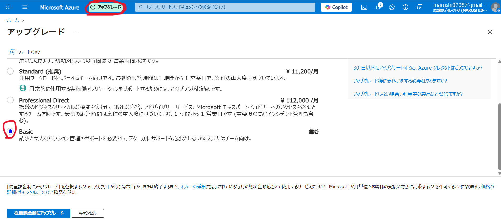

この度はカルステップをご購入いただき、誠にありがとうございます。
正式版では、お客様専用のMicrosoft Azure環境を使用し、Azureの実費はお客様のAzureアカウントへ直接請求されます。本ページのAzureポータル操作はWindows版と共通です。

## 正式版への切り替え

1. 正式版をご希望の旨を [karustep@mjs-company.net](mailto:karustep@mjs-company.net) へご連絡ください。
2. トライアル時にお渡ししたフットスイッチなどの備品は、そのまま継続して利用できます。
3. 端末ライセンスは正式版として運営側で登録します。
4. 以下の手順でAzureアカウントと委任設定を準備してください。

カルステップ本体を更新するよう案内された場合は、[Mac版アップデートマニュアル](../update-manual/)に沿って最新版へ更新してください。

## Azureアカウント開設

解説動画：<a href="https://youtu.be/2_lAmjdG-D8" target="_blank" rel="noopener noreferrer">解説動画を見る</a>

1. <a href="https://azure.microsoft.com/ja-jp/" target="_blank" rel="noopener noreferrer">Microsoft Azure公式サイト</a>を開き、「Azureを無料で試す」から登録を始めます。
2. 使用するメールアドレスを入力し、メールで届く確認コードを使って認証します。
3. 画面の案内に従い、氏名、電話番号、支払い情報などを登録します。
4. 有料のテクニカルサポートプランを案内された場合は、必要性を確認し、不要であれば追加購入しません。
5. Azureポータルへサインインできることを確認します。

> **サブスクリプションが表示されない場合**
>
> まず無料アカウントのサブスクリプションを作成し、運営から案内された時点で従量課金制へアップグレードしてください。従量課金制では、使用したAzureサービス分が請求されます。有料サポートプランはAzureサービスの従量課金とは別契約なので、必要性が不明な場合は契約前に運営へ確認してください。

Azure側の名称や画面配置は変更される場合があります。画面が動画と異なる場合は、契約内容を確定する前に運営へご相談ください。

## 2段階認証

解説動画：<a href="https://youtu.be/2qsM79MaTkQ" target="_blank" rel="noopener noreferrer">解説動画を見る</a>

Azureアカウントを保護するため、2段階認証を必ず設定してください。

1. Azureへ登録したMicrosoftアカウントのセキュリティ画面を開きます。
2. 個人用Microsoftアカウントでは「サインイン方法の管理」から「2段階認証」をオンにします。職場または学校アカウントでは「セキュリティ情報」から認証方法を追加します。
3. Microsoft Authenticatorなどの認証アプリを登録し、画面の案内に沿って確認を完了します。
4. 一度サインアウト・サインインし直し、追加認証を利用できることを確認します。

## Azure Lighthouseの委任

解説動画：<a href="https://youtu.be/FyNI4saCLik" target="_blank" rel="noopener noreferrer">解説動画を見る</a>

カルステップが使用するAzure Speech、Azure OpenAIなどの環境構築を運営へ委任するため、Azure Lighthouseを設定します。

この作業は、対象サブスクリプションの**所有者（Owner）**権限を持つアカウントで行ってください。共同作成者（Contributor）だけでは、委任に必要なロール割り当てを作成できません。

### 1. サブスクリプション名の変更

1. Azureポータル上部の検索欄で「サブスクリプション」を検索して開きます。
2. 利用するサブスクリプションを選択します。
3. 「名前の変更」を開き、クリニック名など運営が識別できる名称へ変更して保存します。
4. 変更が画面へ反映されるまで時間がかかることがあります。

### 2. 委任テンプレートの登録

1. Azureポータルで「サービスプロバイダー」または「Azure Lighthouse」を検索して開きます。
2. 「サービスプロバイダーのオファー」→「オファーの追加」→「テンプレート経由で追加」を選択します。Azureポータルの表示言語によっては、`Service provider offers`→`Add offer`→`Add via template`と表示されます。
3. 運営から案内された **Karustep Lighthouseテンプレート（JSONファイル）**をアップロードします。
4. 「サブスクリプション」で、先ほど名称を変更したサブスクリプションを選択します。
5. 「リージョン」は **(Asia Pacific) Japan East（東日本）**を選択します。
6. 「Msp Offer Name」と「Msp Offer Description」は自動入力された内容から変更しません。
7. 「確認と作成」をクリックし、検証が成功したら「作成」をクリックします。
8. 「デプロイが完了しました」と表示されるまで待ちます。途中で一時的に白い画面になっても、すぐに閉じずお待ちください。

> Mac版DMGには委任テンプレートを同梱していません。運営から届いた最新のJSONファイルを使用してください。

### 3. 委任結果の確認

1. 「サービスプロバイダー」を開き、「委任」を表示します。
2. 「最新の情報に更新」をクリックします。
3. 次の内容が表示されていることを確認します。
   - サブスクリプション名：設定したクリニック名
   - オファー名：Karustep_Lighthouse_Template
   - サービスプロバイダー：合同会社MJSカンパニー
   - ロールの割り当て：運営から指定された「共同作成者」と「マネージドサービス登録割り当て削除ロール」
4. 完了したことを [karustep@mjs-company.net](mailto:karustep@mjs-company.net) へご連絡ください。Azureから運営へ自動通知は届きません。

運営で委任を確認後、お客様専用の正式版API情報を発行します。

Azure側への反映には最大15分程度かかることがあります。すぐに表示されない場合は、ブラウザの更新またはサインインし直したうえで再確認してください。

## 正式版APIキーの登録

1. 運営から届いた1Passwordの共有リンクを開きます。
2. 運営と連絡しているメールアドレスで認証します。閲覧期限は原則7日間です。
3. カルステップを起動し、Macの画面上部にある **「設定」→「API-keyの登録」**を開きます。
4. 運営から案内された次の情報を貼り付けます。
   - Azure Speech Key
   - Azure OpenAI API Key
   - Azure OpenAI Endpoint
   - Azure Functions Key
   - Google Spreadsheet ID
5. 「Google Sheet Name」と「デプロイメント名」は、通常は初期値から変更しません。運営から個別の指定がある場合だけ変更します。
6. 「端末名」へ、診察室Macなど識別しやすい名称を入力します。
7. 「保存」をクリックします。
8. もう一度「設定」→「API-keyの登録」を開き、「一括接続テスト」を実行します。
9. `Speech: OK`、`OpenAI: OK`、`Sheets: OK`の3項目が表示されることを確認します。

「一括接続テスト」はキーチェーンへ保存済みの値を使用するため、初回は必ず保存後に画面を開き直して実行してください。

APIキーはMacのキーチェーンへ安全に保存されます。同じMacでアプリを更新しても再登録は通常不要です。別のMacへ移行する場合は、キーチェーンからAPIキーが自動移行されないため、移行先で再登録してください。

基本操作とmacOSの権限設定は [Mac版トライアル・基本操作マニュアル](../trial-manual/#macosの権限設定) をご確認ください。

## Azure利用料金の確認

解説動画：<a href="https://youtu.be/2DVJKqh7aqU" target="_blank" rel="noopener noreferrer">解説動画を見る</a>

1. Azureポータルへサインインします。
2. 「サブスクリプション」を検索し、カルステップで使用しているサブスクリプションを開きます。
3. 左側のメニューから「コスト管理」→「コスト分析」を開きます。
4. 期間を「今月」などへ変更し、実際の費用と予測費用を確認します。
5. 必要に応じて「日単位」表示やサービス別のグループ化を利用してください。

Azureの料金は利用量に応じて変動します。予算アラートなどAzureの費用管理機能も活用し、定期的に利用状況をご確認ください。

各バージョンの変更内容は [Mac版変更履歴](../changelog/) を、更新方法は [Mac版アップデートマニュアル](../update-manual/) をご確認ください。

ご不明な点は [karustep@mjs-company.net](mailto:karustep@mjs-company.net) までお問い合わせください。
