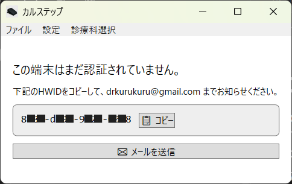

最終更新日：2025/07/17（v2.0）

この度はカルステップをご購入いただき誠にありがとうございます！
以下に、カルステップの初期設定方法をご紹介いたします。
ご不明な点がございましたら、担当者 丸山（ [drkurukuru@gmail.com](mailto:drkurukuru@gmail.com) ） までいつでもご相談ください。

# googleスプレッドシートの共有
解説動画： [https://youtu.be/VYT80F02riw](https://youtu.be/VYT80F02riw)

1. 運営（ drkurukuru@gmail.com ）にクリニックで使用されるGoogleアカウント（gmailなど）をお知らせください。（googleフォームで回答済の方は省略可能です）
2. 運営より、あなた専用のGoogleスプレッドシートの共有連絡がメールで届きます。
3. 続いて、「スプレッドシートのオーナーとして招待されました」というメールが届くので、「承諾」してください。
上記の作業により、スプレッドシートの所有権があなたに移譲されます。運営は共有メンバーから抜けるので、このスプレッドシートはあなたのアカウントしか閲覧・編集できない状態となります。
個人情報保護のため、ご使用になるGoogleアカウントは必ず２段階認証を採用してください。

# ライセンス認証
解説動画：[https://youtu.be/mWNne-xiKKE](https://youtu.be/mWNne-xiKKE)

ダウンロードサイト： [https://mjs-com.github.io/karustep-download-site/](https://mjs-com.github.io/karustep-download-site/)

1. 上記URLから最新版のzipファイルをダウンロードしてください。
2. zipファイルを解凍し、「カルステップ.bat」をダブルクリックするとアプリが起動します。
3. 初回は端末番号（HDIW）の書かれた画面が出てくるので、「メールを送信」ボタンをクリックします。
 
4. メールに「クリニック名」と「購入時の使用したお名前」を追加で記載し、メールを送信してください。
5. 運営よりライセンス登録完了のメールが届いたら完了です。

# Azureアカウント開設と委任の設定
## Azureアカウント開設
解説動画： [https://youtu.be/2_lAmjdG-D8](https://youtu.be/2_lAmjdG-D8)

1.  Googleなどの検索エンジンで「Azure」と検索し、「Microsoft Azure」の公式サイトをクリックしてください。
2.  Azureのページが表示されたら、「Azure を無料でお試しください」をクリックします。
3.  「アカウントをお持ちでない場合、作成できます」の下線が引いてある「作成」リンクをクリックしてください。
4.  登録に使用するメールアドレスを入力します。
5.  入力したメールアドレスに届いたセキュリティコード（確認コード）を入力します。
6.  画面の指示に従い、生年月日などの必要情報を入力します。
7.  電話番号を入力し、SMSなどで受信した確認コードを入力して認証を行ってください。
8.  利用規約等への同意にチェックを入れ、「次へ」をクリックします。
9. クレジットカードの情報を入力します。（最初の30日間は200ドル相当の無料クレジットが利用可能です。）
10. アカウントの保護に関する設定画面が表示された場合は、画面の指示に従い「次へ」をクリックして進めてください。
11. アグリーメント（契約条件）を確認し、同意のチェックを入れて次に進みます。
12. テクニカルサポートのプラン選択画面が表示された場合、「サポートに加入しない」を選んでください。
上記の手順が完了すると、Azureアカウントの登録は終了です。これで、Azureの各種サービスが利用可能な状態になります。

## 2段階認証の設定
解説動画： [https://youtu.be/2qsM79MaTkQ](https://youtu.be/2qsM79MaTkQ)

Azureアカウントのセキュリティを強化するため、2段階認証の設定を強く推奨いたします。

1.  Azureポータルの右上に表示されているご自身のアカウントアイコンをクリックし、「Microsoft アカウント」を選択してください。
2.  表示されたアカウント管理ページの左側にあるタブから「セキュリティ」を選択します。
3.  セキュリティのオプションが表示されますので、「サインイン方法の管理」をクリックしてください。
4.  2段階認証の項目を見つけ、「オンにする」をクリックします。
    * まだアカウントのパスワードを設定していない場合は、このタイミングでパスワードの設定を求められることがあります。画面の指示に従ってパスワードを設定してください。
5.  追加認証の方法を選択する画面が表示されます。セキュリティの観点から、認証アプリ（例：Microsoft Authenticator）のご利用をお勧めします。
    - 認証の手段が「アプリ」になっている状態で「今すぐ取得」ボタンをクリックします。
    - 携帯電話（スマートフォン）で認証アプリを準備します。Microsoft Authenticatorアプリ（鍵の中に人が描かれたようなアイコンが目印です）をダウンロードし、インストールしてください。
    - アプリの準備が整ったら、パソコンの画面で「次へ」をクリックします。
    - パソコンの画面にQRコードが表示されます。携帯電話にインストールしたMicrosoft Authenticatorアプリを起動し、画面の指示に従ってこのQRコードをスキャンしてください。（右下にQRコードアイコンがあるのでそれをタップします。）
    - QRコードの読み取りが成功し、アプリとの連携が完了すると、認証アプリによる2段階認証の基本的なセットアップは完了です。
すべての設定が完了したら、再度セキュリティの画面に戻り、2段階認証が「オン」になっていることをご確認ください。
    * **注記：** 設定直後に2段階認証が「オフ」と表示されている場合があります。その際は、一度ページを更新するか、再度2段階認証の管理画面に入り直して設定状況を確認してください。正しく設定が完了していれば、「2段階認証が承認されました」といった趣旨のメッセージが表示されるか、ステータスが「オン」に変わります。
以上で、2段階認証の設定は完了です。これにより、アカウントのセキュリティが向上します。

## Azureの委任手続き
解説動画： [https://youtu.be/FyNI4saCLik](https://youtu.be/FyNI4saCLik)

カルステップでは、Azureサービスによる文字起こしや生成AIの機能を利用します。これらの詳細な設定作業をカルステップ運営にお任せいただくための委任設定についてご説明します。

1.  **サブスクリプション名の変更**
    1.  Azureポータルの検索バーに「サブスク」と入力し、表示された「サブスクリプション」を選択してください。
    2.  リストに表示されている「Azure サブスクリプション 1」（または類似の名称のサブスクリプション）をクリックします。
    
        **【重要】 サブスクリプションが一覧にない場合**
        - もし一覧にサブスクリプションが表示されない場合は、新規作成が必要です。まず**「無料試用版」でサブスクリプション**を作成してください。
        - ただし、無料試用版のままでは本サービスのAI機能（Azure OpenAI Service）がご利用いただけません。そのため、作成後に**従量課金プランへのアップグレード**が必要となります。
        - **アップグレードの手順は非常に簡単です：**
            1. サブスクリプション作成後、Azureのホーム画面に戻ってください。
            2. 上部のメニューバーに表示される**「アップグレード」ボタン**をクリックします。
            3. プラン選択画面で、**「Basic」プラン**（月額料金が発生しないプラン）を選択してください。
            4. 画面の指示に従って登録を完了すれば、アップグレード完了です。
        - **ご安心ください。追加の費用負担はありません。**このアップグレード手順を行うことで、無料試用版で取得した**200ドル分の無料クレジットはそのまま継続**してご利用いただけます。1か月後以降も実際に利用した分のみ料金が発生するプランのため、想定外の費用がかかることはありません。
        
    3.  サブスクリプションの詳細画面で、「名前の変更」をクリックしてください。
    4.  表示された入力欄に、あなたの「クリニック名」を入力し、「保存」をクリックします。
        
    * **変更理由：** カルステップ運営側では複数のアカウントを管理しております。誤操作を防ぎ、お客様のアカウントを明確に識別するために、分かりやすい名称に変更をお願いいたします。

2.  **Azure Lighthouseの設定**
    1.  Azureポータルの検索バーに英語で「Lighthouse」と入力し、表示された灯台マークの「Azure Lighthouse」を選択してください。
    2.  Azure Lighthouseの画面が表示されたら、右側にある「サービスプロバイダーのオファーの表示」を選択し、続いて、画面中央の「サービスプロバイダーのオファーの表示」ボタンをクリックしてください。
    3.  画面左上にある「オファーの追加」をクリックし、ドロップダウンメニューから「テンプレート経由で追加」を選択してください。
    4.  「テンプレートをアップロード」の画面が表示されます。あらかじめダウンロードしていただいたカルステップのフォルダ内にある「**karustep-lighthhouse-v2.json**」というファイルを、点線の枠内にドラッグ＆ドロップしてください。
    5.  ファイルが選択されたことを確認し、「アップロード」ボタンをクリックします。
    6.  「カスタムデプロイ」というページに移動します。以下の項目を設定してください。
        * **サブスクリプション：** 先ほど名前を変更したサブスクリプション（例：ご自身のクリニック名）を選択してください。
            * **注記：** サブスクリプション名の変更が反映されるまで10分以上かかる場合があります。変更直後で新しい名前が表示されない場合は、元の「Azure サブスクリプション 1」などの名称を選択して進めていただいて問題ありません。
        * **リージョン：** 「**(Asia Pacific) Japan East**」（東日本）を選択してください。
        * 下部にある「Msp Offer Name」と「Msp Offer Description」の項目は、アップロードしたテンプレートファイルの内容が自動的に反映されるため、変更の必要はありません。
    7.  入力内容を確認し、「確認と作成」ボタンをクリックしてください。
    8.  検証が成功すると、画面下部に青色の「作成」ボタンが表示されますので、クリックしてください。（一時的に白い画面になることがありますが、エラーではありませんのでしばらくお待ちください。）
    9.  「デプロイが完了しました」というメッセージが表示されたら、この作業は完了です。

3.  **委任の確認**
    1.  再度Azureポータルの検索バーから「Azure Lighthouse」を検索し、選択します。
    2.  右側の「サービスプロバイダーのオファーの表示」を選択し、次に右側にある「委任の表示」ボタンをクリックしてください。
    3.  表示されたリストの上部にある「最新の情報に更新」ボタンをクリックします。
    4.  以下の情報が表示されていれば、委任は正しく完了しています。
        * **サブスクリプション名：** ご自身で設定したクリニック名（または元のサブスクリプション名）
        * **オファー名：** Karustep_Lighthouse_Template）
        * **サービスプロバイダー：** 合同会社MJSカンパニー
        * **ロールの割り当て：** 「共同作成者」と「削除ロール」

お疲れ様でした。これでAzureの委任手続きは完了です。
最後に、カルステップ運営サイドでは委任された通知が来ないため、お委任手続きが完了したことをカルステップ運営（[drkurukuru@gmail.com](mailto:drkurukuru@gmail.com) ） までご連絡ください。

ご連絡をいただき次第、API-keyを発行させていただきます。お手数をおかけしますが、どうぞよろしくお願い致します。

## カルステップへのAPI-keyなどの登録
解説動画： [https://youtu.be/oCLn4hZQPRw](https://youtu.be/oCLn4hZQPRw)

Azureの委任手続きが完了したことをカルステップ運営が確認次第、文字起こしや要約に使用するAPI-keyを発行いたします。発行されたAPI-keyなど、カルステップに登録が必要な情報は、まとめてHTML形式の添付ファイルとしてメールでお送りします。

1.  **運営からの情報受領**
    1.  カルステップ運営より、APIキーなどの設定情報が記載された「1Passwordの共有リンク」がメールで届きます。
    2.  このリンクを開くには、運営と連絡を取り合っている「**メールアドレス**」での認証が必要です。メールアドレスを入力すると、認証コードが届きますので、そちらを入力してアクセスしてください。
    3.  **【重要】閲覧可能期間は原則7日間です。**有効期限が過ぎた場合は、再度運営にご連絡ください。

2.  **設定情報の確認**
    1.  添付されているHTMLファイルをPCに保存するか、直接開いてください。
        * HTMLファイルを開くと、Google Chromeなどのブラウザで表示されますが、これはPC内のファイルを開いている状態であり、インターネットには接続されていません。
    2.  ファイルを開くとパスワードの入力が求められます。別途送られてきたメールに記載されているパスワードをコピー＆ペーストし、「認証して開く」をクリックしてください。
    3.  認証に成功すると、以下の4つの情報が表示されます。
        * Azure Speech Key
        * Azure OpenAI API Key
        * Azure OpenAI Endpoint
        * Google Spreadsheet ID

3.  **カルステップアプリへの登録**
    1.  カルステップのアプリケーションを起動してください。
    2.  画面上部の「設定」タブをクリックし、次に「APIキーの登録」を選択してください。
    3.  表示された設定画面の各項目に、先ほどHTMLファイルで確認した情報を入力（コピー＆ペースト）します（HTMLファイルの各項目の右側にあるコピーボタンをクリックすればコピーできます）。
    4.  「Deployment Name」「API Version」「Google Sheet Name」といった項目は、あらかじめ入力されていますので、そのまま変更せずにご使用ください。
    5.  すべての情報の入力が完了したら、画面下部にある「保存」ボタンをクリックしてください。

以上で、カルステップへのAPIキーなどの登録は完了です。これでカルステップの全機能がご利用いただけるようになります。設定お疲れ様でした！

# カルステップの使用方法
カルステップ実演動画： [https://youtu.be/qqGLhJniyZE?si=pFsk52EI-o6-M3bZ](https://youtu.be/qqGLhJniyZE?si=pFsk52EI-o6-M3bZ)

カルステップ使用方法解説動画： [https://youtu.be/40IkbkaXB9o](https://youtu.be/40IkbkaXB9o)

カルステップの基本的な使用方法について、フットスイッチでの操作を軸にご説明します。

### 1. カルステップの起動
1.  カルステップが保存されているフォルダを開き、「カルステップ.bat」をダブルクリックしてアプリケーションを起動します。
2.  ライセンス認証が正常に完了していれば、カルステップのメイン操作画面が表示されます。

### 2. 基本的な使用方法（フットスイッチ操作）
カルステップは、フットスイッチを活用したハンズフリー操作をお勧めしています。以下の3ステップで、録音から電子カルテへの転記までが完了します。

1.  **録音**
    * **開始**: フットスイッチを一度踏むと録音が開始されます。
    * **終了**: もう一度フットスイッチを踏むと録音が終了し、自動で文字起こしと要約処理が始まります。この操作は、カルステップの画面が最前面にない状態（例：電子カルテを操作中）でも有効です。

2.  **処理完了の確認**
    * カルステップの動作状況は、タスクバーのアイコンの色で一目で分かります。        
    

    * **録音中**: アイコンが**赤く点滅**します。
    * **処理完了後**: アイコンが**緑色**に変わります。

3.  **電子カルテへの転記**
    * タスクバーのアイコンが緑色に変わったら、電子カルテなど転記したい場所のテキスト入力欄にカーソルを合わせます。
    * `Alt`キーを押しながらフットスイッチを踏むと、カーソル位置に要約内容が自動で貼り付けられます。
    * **注意**: `Alt`キーを長く押しすぎると、警告のポップアップがでます。フットスイッチを踏む直前から踏んでいる間だけ押すようにしてください。

### 3. 要約内容の確認と編集
カルステップのアプリ画面では、生成された要約内容の確認と編集が可能です。

1.  **要約の直接編集**
    * カルステップのメイン画面に表示された要約テキストは、キーボードで直接編集できます。言い回しの変更や情報の追記にご活用ください。

2.  **編集内容の転記**
    * **フットスイッチで転記**: 内容を編集した後、張り付けたいところにカーソルを持っていって、`Alt` + フットスイッチを押すと、**編集後の最新の内容**が転記されます。
    * **コピーボタンで転記**: アプリ画面の「コピー」ボタンで内容をコピーし、任意の場所に手動で貼り付けることも可能です。

### 4. 画面ボタンでの操作（補足）
フットスイッチを使わない場合や、より細かい操作をしたい場合は、画面上のボタンでも操作可能です。

* **スタート**: 録音を開始します。
* **ストップ**: 録音を終了し、要約処理を開始します。
* **一時停止**: 録音を一時的に中断します。患者さんが少し席を外してすぐに戻る、といった短い中断に適しています。
* **リスタート**: 一時停止した録音を再開します。

**【推奨される運用】**

検査待ちなどで長時間中断し、その間に他の患者さんを診察するような場合は、「一時停止」ではなく一度「ストップ」で録音を終了してください。そして、後ほど検査結果を説明する際に、新しい録音を開始する運用がスムーズでおすすめです。

### 5. 記録の確認と活用
「要約を表示」ボタンや、データが保存される`temp`フォルダを活用することで、記録を効果的に管理・共有できます。

* **過去の記録を一覧で確認**
    * メイン画面の「**要約を表示**」ボタンをクリックすると、過去の記録が一覧表示されたスプレッドシートが開きます。
    * このシートはクリニックのアカウントでのみ閲覧できるようセキュリティ設定されているため、院内のPCから安全にリアルタイムで診察状況を共有できます。
    * 例えば、クラークやシュライバーがこの画面を別の端末から確認し、迅速にカルテ作成を進める、といった連携が可能です。
    * **（補足）** スプレッドシートからワンクリックで要約をコピーできる便利なGoogle Chrome拡張機能もご用意しています。詳細は後述します。

* **データファイルの管理**
    * 録音した音声ファイル（.wav）や全文テキスト（.txt）は、PCの`C:\temp`フォルダに保存されています。
    * これらのデータは容量が小さいため、メンテナンスは**年に1回程度**で十分です。
    * 削除する際は、`temp`フォルダごと削除して問題ありません。次回カルステップ起動時に、フォルダは自動で再生成されます。
    

### 6. 応用設定
よりご自身の診療スタイルに合わせるための設定項目です。

* **出力形式の変更**
    * 「**診療科選択**」タブから、要約の出力形式を変更できます。
        * **デフォルト**: 複数話者がいる場合など、汎用的に利用できます。
        * **内科（1対1）**: 医師と患者様の一対一の対話に最適化されています。
        * **簡潔なSOAP形式**: 忠実なSOAP形式で各項目3行程度で簡潔に記録されます。**忙しいクリニック様にオススメです！**
        * **会話ログ形式**: 会話のやり取りが時系列でそのまま記録されます。

* **外部デバイスへのキー割り当て**
    * ゲーミングマウスの副ボタンやStream Deckなどをご利用の場合は、以下のショートカットキーを割り当ててください。
        * **録音開始/終了**: `Ctrl` + `Shift` + `,` (カンマ)
        * **要約の貼り付け**: `Alt` + `Ctrl` + `Shift` + `,` (カンマ)

# カルステップのシステムプロンプトと補正辞書の編集方法
解説動画： [https://youtu.be/9_5bIymDD3Q](https://youtu.be/9_5bIymDD3Q)

カルステップでは、AIによる文字起こしや要約の精度、さらには出力される情報の形式を、診療科や状況に合わせてより最適化するために、システムプロンプトと補正辞書を編集する機能を提供しています。

### 1. システムプロンプトの選択と編集
システムプロンプトは、AIに対してどのような役割を期待し、どのような情報に基づいて、どのような形式でアウトプットを生成してほしいかを指示するための設定群です。

#### a. システムプロンプトの選択
1.  カルステップアプリの画面右上にある「診療科選択」タブをクリックしてください。
2.  あらかじめ登録されているシステムプロンプトの一覧（例：「デフォルト（同時複数患者可）」「簡潔なSOAP形式」「会話ログあり」など）が表示されます。利用するシーンや目的に最も適したものを選択してください。

また、システムプロンプトは追加可能です。カルステップのフォルダの中にある「programs」フォルダに入ると、システムプロンプトがあります。このうちのどれかを複製すれば、システムプロンプトを増やせます。ファイル名は必ず「2桁の数字＋名前」にしてください。例えば「02.耳鼻科オリジナル.txt」といった形でファイル名を設定してください。

#### b. システムプロンプトの編集
現在選択しているシステムプロンプトの内容をカスタマイズしたり、必要に応じて新たなシステムプロンプトを作成したりすることが可能です。

1.  アプリ画面上部の「設定」タブよりシステムプロンプトの編集画面を開きます。
2.  編集画面では、主に以下のような項目について、AIへの指示を具体的に記述・編集することができます。
    * **入力フォーマット**: AIにどのような内容を覚えておいてほしいか指定できます。
    * **出力項目と内容の指示**: Googleスプレッドシートの各セル（「fact」「assessment」「ToDo」）に、どのような情報を、どのような形式や粒度で記述してほしいかを詳細に指示します。
        * **具体例**: 「会話ログあり」のプロンプトの場合、「To-Doセクション」に「発話された内容を可能な限り忠実に転記すること」といった指示を含めることで、会話の逐語記録に近い出力を得ることができます。
3.  編集が完了したら、必ず「保存」ボタンをクリックして、変更内容をシステムプロンプトに適用してください。

### 2. 補正辞書の編集
補正辞書に特定の単語やフレーズを登録しておくことで、専門用語、略語、固有名称（医薬品名、施設名、地域名など）、あるいは特有の言い回しについて、AIがより正確に認識し、意図した通りの正しい表記で出力するよう促すことができます。

1.  カルステップアプリ内の「設定」タブから「補正辞書の編集」画面を開いてください。
2.  以下の形式に従って、AIに正しく認識・変換させたい言葉と、それに対応する正しい表記を一行ずつ登録します。
    * **登録形式**: `AIに認識させたい言葉（ひらがなでの入力推奨、またはAIが誤認識しやすい実際の入力例）` → `AIに出力させたい正しい表記（漢字、カタカナ、正式名称など）`
    * **登録例**:
        * `じびいんこうか` → `耳鼻咽喉科`
        * `かるなーる` → `カロナール`
        * `あいしーゆー` → `ICU（集中治療室）`
        * `ぷろびーえぬぴー` → `proBNP（心不全参考値）`
3.  必要な単語の登録や編集が完了したら、「保存」ボタンをクリックしてください。

## Google Chrome拡張機能「コピペ for カルステップ」の使い方
解説動画： [https://youtu.be/1KvAidC7mGs](https://youtu.be/1KvAidC7mGs)

クラークやシュライバーの方が、カルステップで生成された要約をより効率的にカルテへ転記するためのGoogle Chrome拡張機能です。

#### 1. インストール
1.  以下のURLから、Chromeウェブストアのページを開きます。
    [https://chrome.google.com/webstore/detail/kihmejakcdmlddhpdnekdbnlpgnbgpmp](https://chrome.google.com/webstore/detail/kihmejakcdmlddhpdnekdbnlpgnbgpmp)
2.  「**Chromeに追加**」ボタンをクリックします。
3.  確認画面が表示されたら、「**拡張機能を追加**」をクリックします。
4.  これでインストール完了です。

#### 2. ツールバーへの固定（ピン留め）
インストールした拡張機能をすぐに使えるように、ツールバーに固定（ピン留め）することをおすすめします。

1.  Chromeの右上にある、パズルのピースのような**拡張機能アイコン**をクリックします。
2.  拡張機能の一覧が表示されるので、「コピペ for カルステップ」の横にある**ピンのアイコン**をクリックして有効にします。
3.  ツールバーにカルステップのアイコンが常に表示されるようになります。

#### 3. 初回設定（スプレッドシートIDの登録）
初めて使用する際に、どのスプレッドシートから情報をコピーするかを設定します。

1.  ツールバーに固定した「コピペ for カルステップ」のアイコンを一度クリックします。初回のみ設定画面が開きます。
2.  「スプレッドシートIDを入力してください」という欄が表示されます。
3.  ここに、カルステップ本体の設定時にも使用した**スプレッドシートID**を貼り付けます。
    * **スプレッドシートIDとは？**
        スプレッドシートを開いた際の、URLの中央部分にある長い英数字の文字列です。
        `https://docs.google.com/spreadsheets/d/`**`ここに表示されている長い文字列`**`/edit`
4.  IDを貼り付けたら、「**保存**」ボタンをクリックします。これで準備は完了です。

#### 4. 使用方法
設定完了後の使い方は非常にシンプルです。

1.  カルステップによってスプレッドシートの要約が更新されたことを確認します。
2.  「コピペ for カルステップ」のアイコンをクリックします。
3.  アイコンの表示が「`...`」から「`OK`」に変わったら、コピー完了の合図です。
4.  電子カルテなど、貼り付けたい場所にペースト（`Ctrl+V`など）します。スプレッドシートの一番上の行にある最新の要約内容が貼り付けられます。

#### 5. 効率的な運用方法
本拡張機能には、スプレッドシートが更新されたことを自動で通知する機能はありません。そのため、以下の運用を推奨します。

* 画面の片方に電子カルテなどを表示し、もう片方にスプレッドシートの画面が少し見えるように配置します。
* カルステップによってスプレッドシートの**一番上の行が新しい内容に更新されたことを目視で確認**します。
* 更新を確認したら、アイコンをクリックしてコピーし、カルテに貼り付けます。

この流れにより、最新の要約内容をスムーズにカルテへ転記することができます。

## カルステップの月額利用料について（Azure利用料の確認方法）
解説動画： [https://youtu.be/2DVJKqh7aqU](https://youtu.be/2DVJKqh7aqU)

カルステップで利用するAzureサービスの月額利用料（ランニングコスト）をご自身で把握する方法についてご説明します。

1.  **サブスクリプションの選択**
    1.  Azureポータルにサインインします。
    2.  画面上部の検索バーに「サブスクリプション」と入力し、表示された「サブスクリプション」サービスをクリックしてください。
    3.  サブスクリプションの一覧が表示されます。通常、お客様がご利用のサブスクリプションは1つですので、該当のサブスクリプション名（例：ご自身のクリニック名、または「Azure サブスクリプション 1」など）をクリックしてください。

2.  **コスト分析の表示**
    1.  サブスクリプションの詳細画面が開きます。左側のメニューから「コスト管理」の項目の中にある「コスト分析」をクリックしてください。

3.  **コストの確認**
    1.  コスト分析の画面が表示され、利用状況に応じたグラフなどが表示されます。
        * **現在のコストと予測：** グラフには、特定の日付までに実際に使用されたコストと、現時点までの総コストが表示されます。また、薄緑色などで当月の予測コストが示されることもあります。
        * **期間の指定：** 画面上部の日付範囲フィルター（例：「過去 7 日間」「今月」など）で、表示する期間を変更できます。
        * **グラフの詳細：**
            * 「細分性」を「日単位」などに変更すると、日ごとの利用料をグラフで確認できます。
            * 円グラフ表示を見ることで、サービスごとのコスト割合などを確認することも可能です。
        * **グループ化（参考）：** 「グループ化」オプションで「リソースグループ名」などを選択すると、リソースグループごとのコスト内訳が表示されますが、通常、お客様は単一のクリニックでご利用いただくため、複雑な色分け表示にはならない想定です。
    2.  この画面で「実際の費用」や「予測される今月の費用」を確認することで、Azureサービスのランニングコストを把握できます。

ご自身の利用状況を確認し、安心してサービスをご利用いただくための参考となれば幸いです。