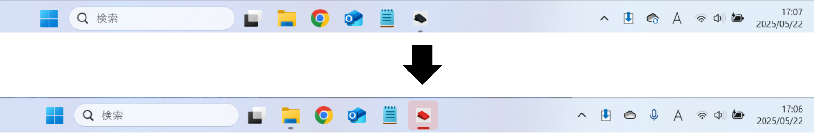
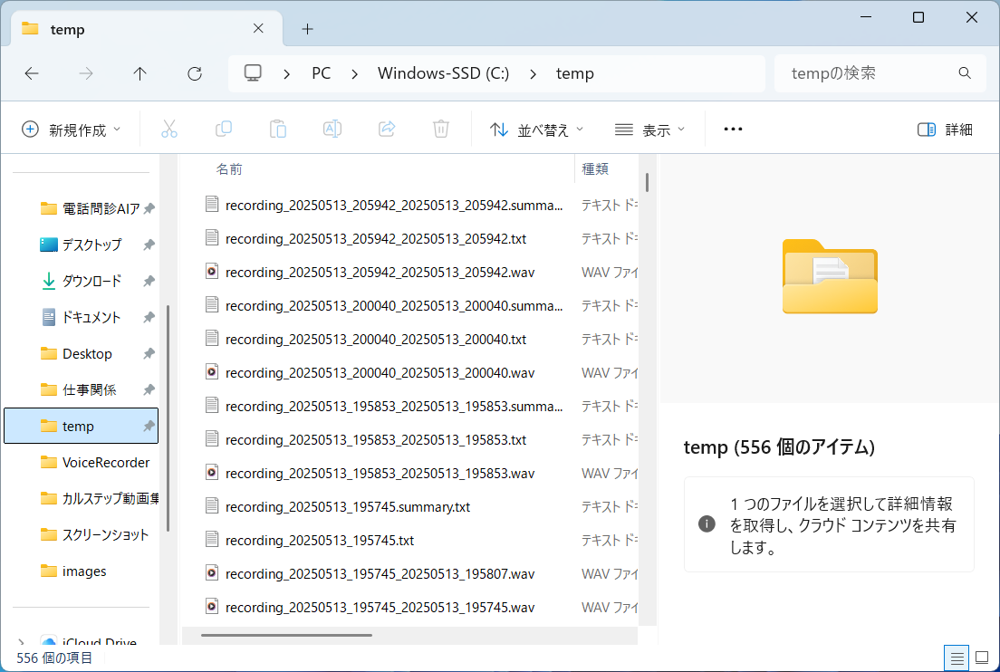
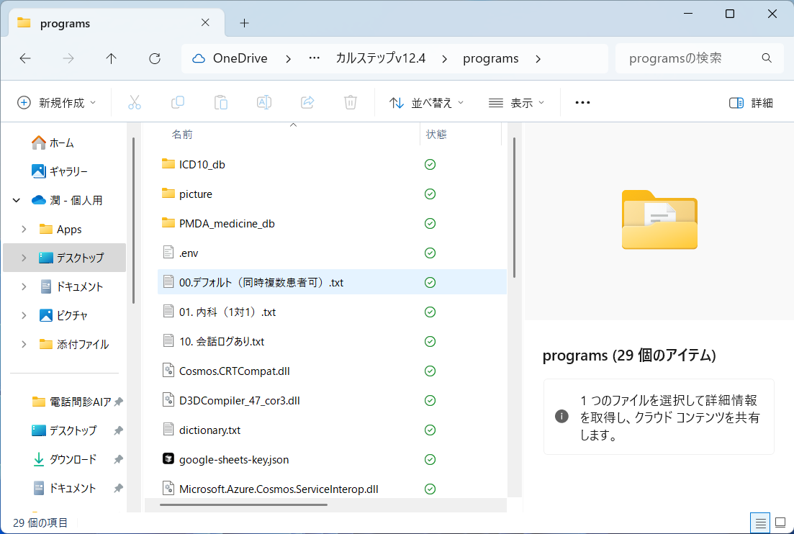
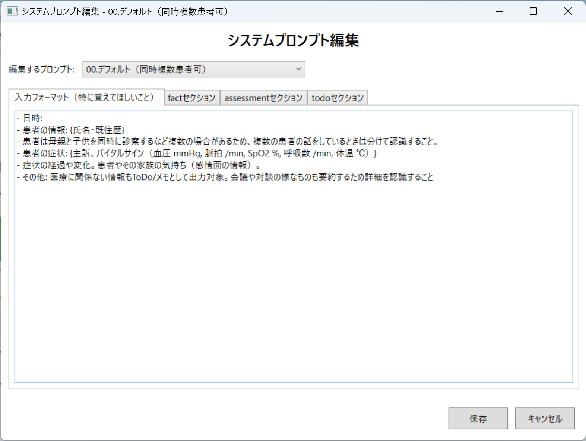
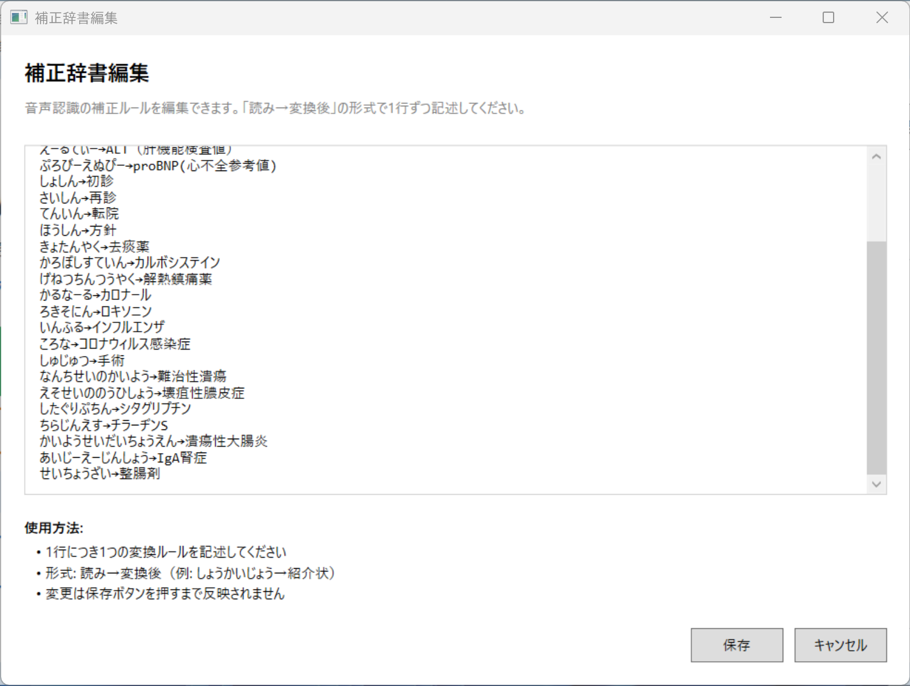

最終更新日：2025/07/20（v1.0）

この度はカルステップの1週間無料トライアルにお申し込みいただき誠にありがとうございます！
本マニュアルでは、インターネット接続可能なWindows環境でのカルステップ初期設定方法をご紹介いたします。
ご不明な点がございましたら、担当者 丸山（ [info@mjs-company.net](mailto:info@mjs-company.net) ） までいつでもご相談ください。

**【ご注意】トライアル期間について**
無料トライアル期間（1週間）終了後、端末ライセンスとAPIキーが自動的に無効化されます。継続してご利用をご希望の場合は、正式版のご購入をご検討ください。

# Googleスプレッドシートの共有
解説動画： <a href="https://youtu.be/VYT80F02riw" target="_blank" rel="noopener noreferrer">https://youtu.be/VYT80F02riw</a>

1. 運営（ info@mjs-company.net ）にクリニックで使用されるGoogleアカウント（gmailなど）をお知らせください。（Googleフォームで回答済の方は省略可能です）
2. 運営より、あなた専用のGoogleスプレッドシートの共有連絡がメールで届きます。
3. 続いて、「スプレッドシートのオーナーとして招待されました」というメールが届くので、「承諾」してください。
上記の作業により、スプレッドシートの所有権があなたに移譲されます。運営は共有メンバーから抜けるので、このスプレッドシートはあなたのアカウントしか閲覧・編集できない状態となります。
個人情報保護のため、ご使用になるGoogleアカウントは必ず２段階認証を採用してください。

# ライセンス認証
解説動画：<a href="https://youtu.be/mWNne-xiKKE" target="_blank" rel="noopener noreferrer">https://youtu.be/mWNne-xiKKE</a>

ダウンロードサイト： <a href="https://mjs-com.github.io/karustep-download-site/" target="_blank" rel="noopener noreferrer">https://mjs-com.github.io/karustep-download-site/</a>

1. 上記URLから最新版のzipファイルをダウンロードしてください。
2. zipファイルを解凍し、「カルステップ.bat」をダブルクリックするとアプリが起動します。
3. 初回は端末番号（HDIW）の書かれた画面が出てくるので、「メールを送信」ボタンをクリックします。
 
4. メールに「クリニック名」と「お名前」を追加で記載し、メールを送信してください。
5. 運営よりライセンス登録完了のメールが届いたら完了です。

### オンプレミス電子カルテへのアプリ導入方法

まず個人のパソコンでZIPファイルをダウンロードし、ZIPファイルを解凍してください。解凍すると **Karustep_v32.0** のような名前のフォルダが出てきます（中に **programs** フォルダ、**Karustep.bat**、**Karustep-Lighthouse-v2.json** の3つが入っています）。

1. 上記のフォルダをUSBメモリに入れ、実際に使用する端末のデスクトップにフォルダごと移動させます。
2. **Karustep.bat**（もしくは「Karustep」と表示されているファイル）をダブルクリックすると、アプリが数秒で立ち上がります。
3. アプリの左側に認証番号が表示されます。その文字列を運営へお知らせください。

# カルステップへのAPI-keyなどの登録（トライアル版）
解説動画： <a href="https://youtu.be/oCLn4hZQPRw" target="_blank" rel="noopener noreferrer">https://youtu.be/oCLn4hZQPRw</a>

トライアル版では、運営が準備したデモ用のAPIキーをご利用いただきます。これにより、Azure関連の複雑な設定作業なしに、すぐにカルステップの全機能をお試しいただけます。

1.  **運営からの情報受領**
    1.  カルステップ運営より、トライアル用の設定情報が記載された「1Passwordの共有リンク」がメールで届きます。
    2.  このリンクを開くには、運営と連絡を取り合っている「**メールアドレス**」での認証が必要です。メールアドレスを入力すると、認証コードが届きますので、そちらを入力してアクセスしてください。
    3.  **【重要】閲覧可能期間は原則7日間です。**有効期限が過ぎた場合は、再度運営にご連絡ください。

2.  **設定情報の確認**
    1.  添付されているHTMLファイルをPCに保存するか、直接開いてください。
        * HTMLファイルを開くと、Google Chromeなどのブラウザで表示されますが、これはPC内のファイルを開いている状態であり、インターネットには接続されていません。
    2.  ファイルを開くとパスワードの入力が求められます。別途送られてきたメールに記載されているパスワードをコピー＆ペーストし、「認証して開く」をクリックしてください。
    3.  認証に成功すると、以下の4つの情報が表示されます。
        * Azure Speech Key（トライアル用）
        * Azure OpenAI API Key（トライアル用）
        * Azure OpenAI Endpoint（トライアル用）
        * Google Spreadsheet ID

3.  **カルステップアプリへの登録**
    1.  カルステップのアプリケーションを起動してください。
    2.  画面上部の「設定」タブをクリックし、次に「APIキーの登録」を選択してください。
    3.  表示された設定画面の各項目に、先ほどHTMLファイルで確認した情報を入力（コピー＆ペースト）します（HTMLファイルの各項目の右側にあるコピーボタンをクリックすればコピーできます）。
    4.  「Deployment Name」「API Version」「Google Sheet Name」といった項目は、あらかじめ入力されていますので、そのまま変更せずにご使用ください。
    5.  すべての情報の入力が完了したら、画面下部にある「保存」ボタンをクリックしてください。

**【トライアル版の特徴】**
- APIの利用料金は運営が負担いたします。
- トライアル期間終了後、APIキーは自動的に無効化されます。
- 正式版ご購入後は、お客様ご自身でAzureアカウントを開設し、専用のAPIキーをご利用いただきます。

以上で、カルステップへのAPIキーなどの登録は完了です。これでカルステップの全機能がご利用いただけるようになります。設定お疲れ様でした！

# カルステップの使用方法
カルステップ実演動画： <a href="https://youtu.be/qqGLhJniyZE?si=pFsk52EI-o6-M3bZ" target="_blank" rel="noopener noreferrer">https://youtu.be/qqGLhJniyZE?si=pFsk52EI-o6-M3bZ</a>

カルステップ使用方法解説動画： <a href="https://youtu.be/40IkbkaXB9o" target="_blank" rel="noopener noreferrer">https://youtu.be/40IkbkaXB9o</a>

カルステップの基本的な使用方法について、フットスイッチでの操作を軸にご説明します。

### 1. カルステップの起動
1.  カルステップが保存されているフォルダを開き、「カルステップ.bat」をダブルクリックしてアプリケーションを起動します。
2.  ライセンス認証が正常に完了していれば、カルステップのメイン操作画面が表示されます。

### 2. 基本的な使用方法（フットスイッチ操作）
カルステップは、フットスイッチを活用したハンズフリー操作をお勧めしています。以下の3ステップで、録音から電子カルテへの転記までが完了します。

1.  **録音**
    * **開始**: フットスイッチを一度踏むと録音が開始されます。
    * **終了**: もう一度フットスイッチを踏むと録音が終了し、自動で文字起こしと要約処理が始まります。この操作は、カルステップの画面が最前面にない状態（例：電子カルテを操作中）でも有効です。

2.  **処理完了の確認**
    * カルステップの動作状況は、タスクバーのアイコンの色で一目で分かります。        
    

    * **録音中**: アイコンが**赤く点滅**します。
    * **処理完了後**: アイコンが**緑色**に変わります。

3.  **電子カルテへの転記**
    * タスクバーのアイコンが緑色に変わったら、電子カルテなど転記したい場所のテキスト入力欄にカーソルを合わせます。
    * 現在のバージョンでは、要約完了時に内容が自動でコピーされるため、そのまま `Ctrl` + `V` でも貼り付けできます。
    * `Alt`キーを押しながらフットスイッチを踏むと、カーソル位置に要約内容が自動で貼り付けられます。
    * **注意**: `Alt`キーを長く押しすぎると、警告のポップアップがでます。フットスイッチを踏む直前から踏んでいる間だけ押すようにしてください。

### 3. 要約内容の確認と編集
カルステップのアプリ画面では、生成された要約内容の確認と編集が可能です。

1.  **要約の直接編集**
    * カルステップのメイン画面に表示された要約テキストは、キーボードで直接編集できます。言い回しの変更や情報の追記にご活用ください。

2.  **編集内容の転記**
    * **フットスイッチで転記**: 内容を編集した後、張り付けたいところにカーソルを持っていって、`Alt` + フットスイッチを押すと、**編集後の最新の内容**が転記されます。
    * **コピーボタンで転記**: アプリ画面の「コピー」ボタンで内容をコピーし、任意の場所に手動で貼り付けることも可能です。

### 4. 画面ボタンでの操作（補足）
フットスイッチを使わない場合や、より細かい操作をしたい場合は、画面上のボタンでも操作可能です。

* **スタート**: 録音を開始します。
* **ストップ**: 録音を終了し、要約処理を開始します。
* **一時停止**: 録音を一時的に中断します。患者さんが少し席を外してすぐに戻る、といった短い中断に適しています。
* **リスタート**: 一時停止した録音を再開します。

**【推奨される運用】**

検査待ちの間に別の患者さんを診察する場合は、録音を「一時停止」して「新規患者」で別タブを作成します。元の患者さんが戻ったら、そのタブを選んで「リスタート」すると、検査前後の内容を1つの要約にまとめられます。

### 5. 記録の確認と活用
「要約を表示」ボタンや、データの保存先フォルダを活用することで、記録を効果的に管理・共有できます。

* **過去の記録を一覧で確認**
    * メイン画面の「**要約を表示**」ボタンをクリックすると、過去の記録が一覧表示されたスプレッドシートが開きます。
    * このシートはクリニックのアカウントでのみ閲覧できるようセキュリティ設定されているため、院内のPCから安全にリアルタイムで診察状況を共有できます。
    * 例えば、クラークやシュライバーがこの画面を別の端末から確認し、迅速にカルテ作成を進める、といった連携が可能です。
    * **（補足）** スプレッドシートからワンクリックで要約をコピーできる便利なGoogle Chrome拡張機能もご用意しています。詳細は後述します。

* **データファイルの管理**
    * 録音音声、文字起こし、要約は、初期設定ではPCの`C:\temp`フォルダに保存されます。
    * 保存先は「設定」→「アプリの設定」→「データ保存先」から、ユーザーデータ領域または任意のフォルダへ変更できます。変更前のファイルは自動では移動しません。
    * 音声ファイルは容量が大きくなることがあります。「設定」→「アプリの設定」で「診療データの自動削除」をONにし、保存期間と削除対象を選んで保存すると、古いデータを起動時に削除できます。初期設定はOFFです。
    * **自動削除したデータは元に戻せません。** 必要なデータを別の場所へ保存してから設定してください。
    

### 6. 応用設定
よりご自身の診療スタイルに合わせるための設定項目です。

* **出力形式の変更**
    * 「**診療科選択**」タブから、要約の出力形式を変更できます。
        * **デフォルト**: 複数話者がいる場合など、汎用的に利用できます。
        * **内科（1対1）**: 医師と患者様の一対一の対話に最適化されています。
        * **簡潔なSOAP形式**: 忠実なSOAP形式で各項目3行程度で簡潔に記録されます。**忙しいクリニック様にオススメです！**
        * **会話ログ形式**: 会話のやり取りが時系列でそのまま記録されます。

* **外部デバイスへのキー割り当て**
    * ゲーミングマウスの副ボタンやStream Deckなどをご利用の場合は、以下のショートカットキーを割り当ててください。
        * **録音開始/終了**: `Ctrl` + `Shift` + `,` (カンマ)
        * **要約の貼り付け**: `Alt` + `Ctrl` + `Shift` + `,` (カンマ)

### 7. 便利な追加機能

#### 事前情報を要約に反映する

タブの「事前情報入力」から患者名、問診、バイタル、検査結果などを保存してから録音すると、事前情報と診察中の会話を合わせて要約できます。

「音声ファイルから要約」を使う場合は、ファイル選択画面の「事前情報を含めて要約する」が初期状態でONになっています。現在のタブとは別の患者さんの音声を処理するときは、誤って事前情報が入らないようチェックを外してください。

#### 音声認識ヒント（フレーズリスト）

薬剤名、検査名、医師名などを登録すると、文字起こしAIがその言葉を聞き取りやすくなります。追加料金はなく、初期状態でONです。

1. 「設定」→「フレーズリストの編集（音声認識ヒント）」を開きます。
2. 追加する言葉を「まとめて追加」へ1行1語で入力し、「追加」→「保存」を押します。
3. 一時的に使わない言葉は一覧のチェックを外します。有効にできる言葉は最大500件です。

補正辞書に登録した正しい表記は、自動でフレーズリストにも追加されます。迷った場合は、まず補正辞書へ登録してください。

#### 新規患者タブのショートカット

* `Ctrl` + `Alt` + `Shift` + `N`：新規患者タブを作成
* `Ctrl` + `Alt` + `Shift` + `R`：新規患者タブを作成して、そのまま録音開始

前の患者さんを録音中の場合は、自動で一時停止してから新しいタブへ移ります。初期状態で有効になっており、「設定」→「アプリの設定」から無効にできます。

#### 複数診察室での引き継ぎ

同じGoogleスプレッドシートを使用している別の診察室や別PCへ、患者情報と診察途中の内容を引き継げます。予診室で記録した問診内容と、診察室での会話を合わせて、ひとつのカルテ文として要約する場合などに利用できます。

この機能は初期状態でONです。利用するすべてのPCが、同じGoogleスプレッドシートを使用する設定になっていることを事前に確認してください。使わない場合は、「設定」→「アプリの設定」→「複数診察室での引き継ぎ」をOFFにできます。

##### 予診室から診察室へ引き継ぐ場合

**予診室での操作**

1. 患者さんごとに新しいタブを作成します。
2. タブ右側の「📝 事前情報入力」を開き、患者名、問診内容、バイタル、検査結果などを入力して「保存」を押します。
3. 「START」を押し、予診時の会話を録音します。
4. 予診が終わったら、**「STOP」ではなく「一時停止」**を押します。
5. ボタンの表示が「引き継ぐ」に変わったら、もう一度そのボタンを押します。
6. 確認画面で「はい」を押します。画面下に「引き継ぎ情報を保存しました」と表示されれば、予診室での操作は完了です。

**診察室での操作**

1. カルステップ上部のメニューから「別の診察室から引き継ぐ」を開きます。
2. 「一時停止の続き（引き継ぎ待ち）」に表示されている患者さんを選びます。
3. 必要に応じて「詳細」を押し、予診室で記録された内容を確認します。
4. 「この患者を引き継ぐ」を押します。
5. 患者名と予診室での内容が事前情報に入った新しいタブが自動で作成されます。
6. そのタブで「START」を押し、通常どおり診察を録音します。
7. 診察終了時に「STOP」を押すと、予診室の問診・バイタル・検査結果などと、診察室での会話を合わせたひとつのカルテ文が生成されます。

> **重要：** 診察を続ける患者さんを別室へ渡す場合、送り元では「STOP」ではなく、必ず「一時停止」→「引き継ぐ」の順に操作してください。

##### すでに診察が終わった患者さんの情報を取り込む場合

1. 受け取り側の診察室で、メニューの「別の診察室から引き継ぐ」を開きます。
2. 「診察完了分（要約から）」から当日の患者さんを選びます。
3. 一覧には短い内容のみ表示されます。全文を確認する場合は「詳細」を押します。
4. 「この患者を引き継ぐ」を押します。
5. 新しいタブが作成され、前の要約内容が事前情報に入ります。必要に応じて追記してから録音を開始してください。

一時停止した患者さんの名前と文字起こし全文は暗号化して一時保存され、Googleスプレッドシートに生の文字起こし全文が平文で保存されることはありません。引き継ぎ待ちの情報は作成後24時間以内のみ表示され、受け取り完了後は引き継ぎ待ちの一覧から削除されます。期限切れの情報は、機能がONの状態でアプリを起動した際に自動削除されます。

#### 2マイク話者分離（おすすめ）

医師用と患者用のマイクを分け、文字起こしに `clinic：`、`patient：` のラベルを付ける機能です。

1. 「設定」→「アプリの設定」で「2マイク話者分離（医師用・患者用）」をONにします。
2. 医師用にはピンマイクなど口元に近いマイク、患者用には患者側の音を拾うマイクを選びます。

通常の話者分離、システム音声キャプチャ、バランス・低負荷・超低負荷モードとは同時に使えません。条件が合わない場合は、通常の単一マイク録音に戻ります。

**従来の「話者分離機能」について：** 1本のマイクに入った声質から話者を推定する旧方式で、環境によって精度が変わります。文字起こし料金も通常の約1円/分に対して約5円/分と高いため、基本的にはおすすめしません。マイクを2本用意できる場合は、2マイク話者分離をおすすめします。

#### 診療科切り替えショートカット

「設定」→「診療科切り替えショートカットキー設定」から、各キーへ使用する診療科を割り当てられます。初期設定は `Ctrl` + `Shift` + `1`〜`5`です。設定画面上部の切り替えで、機能全体を無効にすることもできます。

#### 録音に関する便利な設定

いずれも「設定」→「アプリの設定」から変更し、最後に「保存」を押します。

* **システム音声キャプチャ**：PCから再生される相手の声も録音します。オンライン診療やWeb面談で使用します。2マイク話者分離とは同時に使えません。
* **録音の自動停止**：3分間会話がない場合に録音を自動停止し、AI利用料の無駄を抑えます。病状説明などで長い無音が生じる場合はOFFをおすすめします。
* **録音中のスリープ防止**：録音中だけPCのスリープを防ぎます。長時間の診察、病状説明、会議などではONをおすすめします。

#### その他

* **要約を別形式に作り直す**：「要約再生成」で、作成済みの要約を紹介状など別の形式へ変換できます。
* **録音済みの音声から要約**：オフライン時などに録音だけ行った場合も、インターネット接続後に「音声ファイルから要約」から文字起こしと要約を実行できます。
* **誤変換を簡単に登録**：要約内の誤変換部分を選択して右クリックし、「補正辞書に追加」から正しい表記を登録できます。

# カルステップのシステムプロンプトと補正辞書の編集方法
解説動画： <a href="https://youtu.be/9_5bIymDD3Q" target="_blank" rel="noopener noreferrer">https://youtu.be/9_5bIymDD3Q</a>

カルステップでは、AIによる文字起こしや要約の精度、さらには出力される情報の形式を、診療科や状況に合わせてより最適化するために、システムプロンプトと補正辞書を編集する機能を提供しています。

### 1. システムプロンプトの選択と編集
システムプロンプトは、AIに対してどのような役割を期待し、どのような情報に基づいて、どのような形式でアウトプットを生成してほしいかを指示するための設定群です。

#### a. システムプロンプトの選択
1.  カルステップアプリの画面右上にある「診療科選択」タブをクリックしてください。
2.  あらかじめ登録されているシステムプロンプトの一覧（例：「デフォルト（同時複数患者可）」「簡潔なSOAP形式」「会話ログあり」など）が表示されます。利用するシーンや目的に最も適したものを選択してください。

また、システムプロンプトは追加可能です。カルステップのフォルダの中にある「programs」フォルダに入ると、システムプロンプトがあります。このうちのどれかを複製すれば、システムプロンプトを増やせます。ファイル名は必ず「2桁の数字＋名前」にしてください。例えば「02.耳鼻科オリジナル.txt」といった形でファイル名を設定してください。

#### b. システムプロンプトの編集
現在選択しているシステムプロンプトの内容をカスタマイズしたり、必要に応じて新たなシステムプロンプトを作成したりすることが可能です。

1.  アプリ画面上部の「設定」タブよりシステムプロンプトの編集画面を開きます。
2.  編集画面では、主に以下のような項目について、AIへの指示を具体的に記述・編集することができます。
    * **入力フォーマット**: AIにどのような内容を覚えておいてほしいか指定できます。
    * **出力項目と内容の指示**: Googleスプレッドシートの各セル（「fact」「assessment」「ToDo」）に、どのような情報を、どのような形式や粒度で記述してほしいかを詳細に指示します。
        * **具体例**: 「会話ログあり」のプロンプトの場合、「To-Doセクション」に「発話された内容を可能な限り忠実に転記すること」といった指示を含めることで、会話の逐語記録に近い出力を得ることができます。
3.  編集が完了したら、必ず「保存」ボタンをクリックして、変更内容をシステムプロンプトに適用してください。

### 2. 補正辞書の編集
補正辞書に特定の単語やフレーズを登録しておくことで、専門用語、略語、固有名称（医薬品名、施設名、地域名など）、あるいは特有の言い回しについて、AIがより正確に認識し、意図した通りの正しい表記で出力するよう促すことができます。

1.  カルステップアプリ内の「設定」タブから「補正辞書の編集」画面を開いてください。
2.  以下の形式に従って、AIに正しく認識・変換させたい言葉と、それに対応する正しい表記を一行ずつ登録します。
    * **登録形式**: `AIに認識させたい言葉（ひらがなでの入力推奨、またはAIが誤認識しやすい実際の入力例）` → `AIに出力させたい正しい表記（漢字、カタカナ、正式名称など）`
    * **登録例**:
        * `じびいんこうか` → `耳鼻咽喉科`
        * `かるなーる` → `カロナール`
        * `あいしーゆー` → `ICU（集中治療室）`
        * `ぷろびーえぬぴー` → `proBNP（心不全参考値）`
3.  必要な単語の登録や編集が完了したら、「保存」ボタンをクリックしてください。

## Google Chrome拡張機能「コピペ for カルステップ」の使い方
解説動画： <a href="https://youtu.be/1KvAidC7mGs" target="_blank" rel="noopener noreferrer">https://youtu.be/1KvAidC7mGs</a>

クラークやシュライバーの方が、カルステップで生成された要約をより効率的にカルテへ転記するためのGoogle Chrome拡張機能です。

#### 1. インストール
1.  以下のURLから、Chromeウェブストアのページを開きます。
    <a href="https://chrome.google.com/webstore/detail/kihmejakcdmlddhpdnekdbnlpgnbgpmp" target="_blank" rel="noopener noreferrer">https://chrome.google.com/webstore/detail/kihmejakcdmlddhpdnekdbnlpgnbgpmp</a>
2.  「**Chromeに追加**」ボタンをクリックします。
3.  確認画面が表示されたら、「**拡張機能を追加**」をクリックします。
4.  これでインストール完了です。

#### 2. ツールバーへの固定（ピン留め）
インストールした拡張機能をすぐに使えるように、ツールバーに固定（ピン留め）することをおすすめします。

1.  Chromeの右上にある、パズルのピースのような**拡張機能アイコン**をクリックします。
2.  拡張機能の一覧が表示されるので、「コピペ for カルステップ」の横にある**ピンのアイコン**をクリックして有効にします。
3.  ツールバーにカルステップのアイコンが常に表示されるようになります。

#### 3. 初回設定（スプレッドシートIDの登録）
初めて使用する際に、どのスプレッドシートから情報をコピーするかを設定します。

1.  ツールバーに固定した「コピペ for カルステップ」のアイコンを一度クリックします。初回のみ設定画面が開きます。
2.  「スプレッドシートIDを入力してください」という欄が表示されます。
3.  ここに、カルステップ本体の設定時にも使用した**スプレッドシートID**を貼り付けます。
    * **スプレッドシートIDとは？**
        スプレッドシートを開いた際の、URLの中央部分にある長い英数字の文字列です。
        `https://docs.google.com/spreadsheets/d/`**`ここに表示されている長い文字列`**`/edit`
4.  IDを貼り付けたら、「**保存**」ボタンをクリックします。これで準備は完了です。

#### 4. 使用方法
設定完了後の使い方は非常にシンプルです。

1.  カルステップによってスプレッドシートの要約が更新されたことを確認します。
2.  「コピペ for カルステップ」のアイコンをクリックします。
3.  アイコンの表示が「`...`」から「`OK`」に変わったら、コピー完了の合図です。
4.  電子カルテなど、貼り付けたい場所にペースト（`Ctrl+V`など）します。スプレッドシートの一番上の行にある最新の要約内容が貼り付けられます。

#### 5. 効率的な運用方法
本拡張機能には、スプレッドシートが更新されたことを自動で通知する機能はありません。そのため、以下の運用を推奨します。

* 画面の片方に電子カルテなどを表示し、もう片方にスプレッドシートの画面が少し見えるように配置します。
* カルステップによってスプレッドシートの**一番上の行が新しい内容に更新されたことを目視で確認**します。
* 更新を確認したら、アイコンをクリックしてコピーし、カルテに貼り付けます。

この流れにより、最新の要約内容をスムーズにカルテへ転記することができます。

# トライアル期間終了後について

## トライアル期間終了時の動作
無料トライアル期間（1週間）が終了すると、以下の変更が自動的に行われます：

1. **端末ライセンスの無効化**
   - カルステップアプリケーションの起動時にライセンス認証エラーが表示されます
   - アプリケーションの機能がすべて使用できなくなります

2. **APIキーの無効化**
   - 文字起こし機能が停止します
   - AI要約機能が停止します
   - すべてのAzure関連サービスへのアクセスが遮断されます

3. **データの保護**
   - これまでに作成された録音ファイルや要約データは、PC内（`C:\temp`フォルダ）に保存されたまま残ります
   - Googleスプレッドシートの所有権はお客様のままです

## トライアル後の備品について

### 正式版をご購入いただく場合
お渡しした備品（フットスイッチなど）は、そのまま継続してご利用ください。追加の手続きは必要ありません。

### ご購入に至らなかった場合
大変恐縮でございますが、備品の返送をお願いしております。返送料はユーザー様のご負担となります。レターパックプラス（600円）が現状最安値かと思います。返送先については、トライアル終了時にご案内いたします。

## 正式版購入をご検討の場合

トライアルをお試しいただき、カルステップの導入をご検討いただける場合は、以下の流れとなります：

### 1. 購入お申し込み
カルステップ運営（[info@mjs-company.net](mailto:info@mjs-company.net)）までご連絡ください。正式版の購入手続きについてご案内いたします。

### 2. 正式版での設定変更
正式版では、以下の点がトライアル版と異なります：

**APIキーについて**
- お客様ご自身でMicrosoft Azureアカウントを開設していただきます
- カルステップ運営がAzure環境の設定を代行いたします（委任設定）
- お客様専用のAPIキーを発行し、月額利用料はお客様のAzureアカウントに直接請求されます

**ライセンスについて**
- 端末ライセンスが正式版として再発行されます
- 継続的にご利用いただけるライセンスとなります

### 3. 移行作業
正式版への移行時は、以下のデータがそのまま引き継がれます：
- これまでの録音ファイル（`C:\temp`フォルダ内）
- Googleスプレッドシートのデータ
- システムプロンプトや補正辞書のカスタマイズ内容

## トライアルご利用の皆様へのお願い

カルステップの改善のため、トライアル期間終了後に以下のご協力をお願いしております：

### 1. Web面談でのフィードバック
ご購入の有無に関わらず、トライアル終了後に短時間のWeb面談でご感想をお聞かせください。いただいたご意見は、今後の製品改良の貴重な参考とさせていただきます。面談の日程については、トライアル期間終了前にメールでご相談させていただきます。

### 2. X（旧Twitter）での感想投稿
カルステップのご感想をX（旧Twitter）でシェアをお願いいたします。投稿の際は「#カルステップ」を添えて、以下の投稿を引用リポストしてください。

対象投稿： <a href="https://x.com/Dr_kurukuru/status/1945487347409412533" target="_blank" rel="noopener noreferrer">https://x.com/Dr_kurukuru/status/1945487347409412533</a>

皆様のご意見が、より良い製品づくりに繋がります。ご協力のほど、よろしくお願いいたします。

## お問い合わせ

トライアル期間中やご購入に関するご質問は、いつでもお気軽にお問い合わせください。

**連絡先：** カルステップ運営 丸山  
**メールアドレス：** [info@mjs-company.net](mailto:info@mjs-company.net)
